## Testing

### Responsiveness

All pages were tested to ensure responsiveness on screen sizes from 320px and upwards as defined in [WCAG 2.1 Reflow criteria for responsive design](https://www.w3.org/WAI/WCAG21/Understanding/reflow.html) on Chrome, Edge, Firefox and Opera browsers.

Steps to test:

1. Open browser and navigate to [cowboytanaka]()
2. Open the developer tools (right click and inspect)
3. Set to responsive and decrease width to 320px
4. Set the zoom to 50%
5. Click and drag the responsive window to maximum width

Expected:

Website is responsive on all screen sizes and no images are pixelated or stretched.
No horizontal scroll is present.
No elements overlap.

Actual:

Website behaved as expected.

Website was also opened on the following devices and no responsive issues were seen:

- Samsung A15
- iPad Pro
- Lenovo Ideapad S540

### Accessibility

Wave Accessibility tool was used throughout development and for final testing of the deployed website to check for any aid accessibility testing.

Testing was focused to ensure the following criteria were met:

- All forms have associated labels or aria-labels so that this is read out on a screen reader to users who tab to form inputs
- Color contrasts meet a minimum ratio as specified in WCAG 2.1 Contrast Guidelines
- Heading levels are not missed or skipped to ensure the importance of content is relayed correctly to the end user
- All content is contained within landmarks to ensure ease of use for assistive technology, allowing the user to navigate by page regions
- All not textual content had alternative text or titles so descriptions are read out to screen readers
- HTML page lang attribute has been set
- Aria properties have been implemented correctly
- WCAG 2.1 Coding best practices being followed
- Manual tests were also performed to ensure the website was accessible as possible and an accessibility issue was identified.

### Lighthouse Testing

#### __Home Page__

#### __Info Page__

#### __News Page__

#### __News Detail Page__

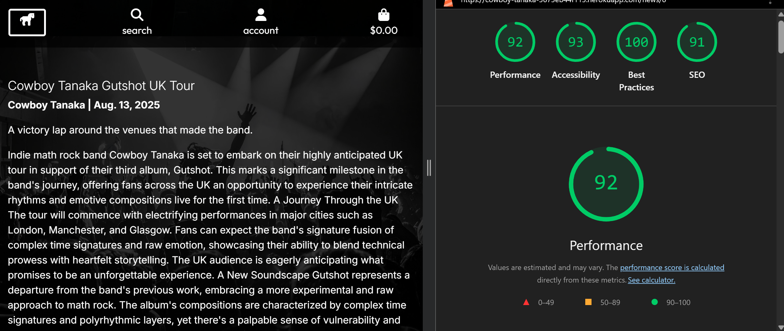

#### __Tour Dates Page__

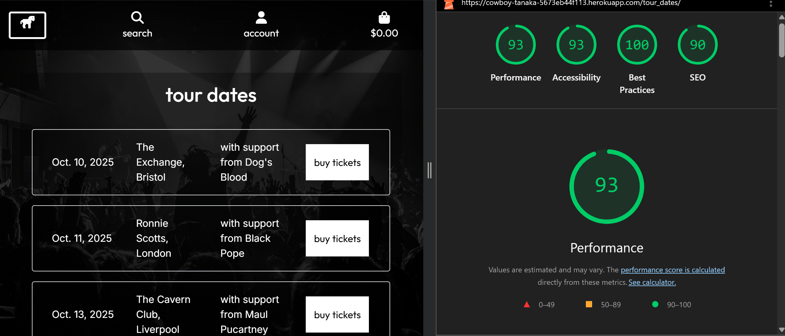

#### __Tickets Page__

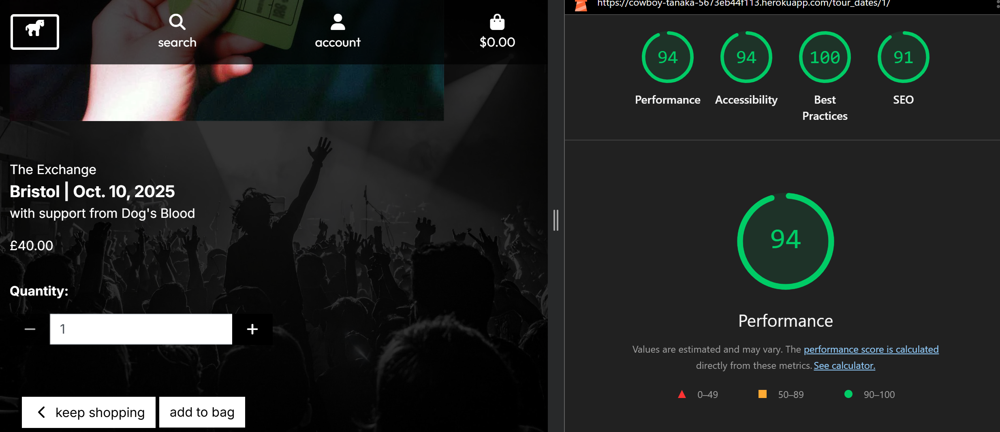

#### __Merch Page__

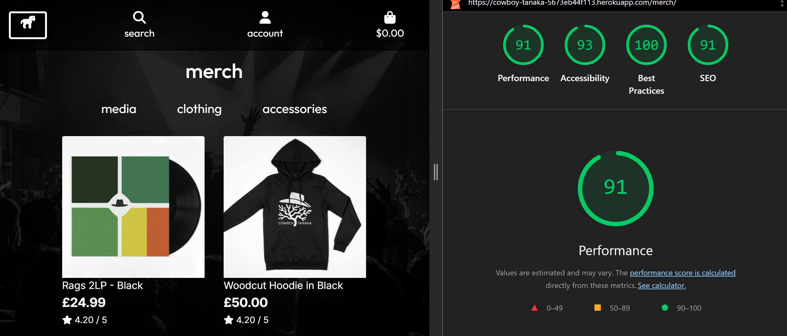

#### __Merch Detail Page__

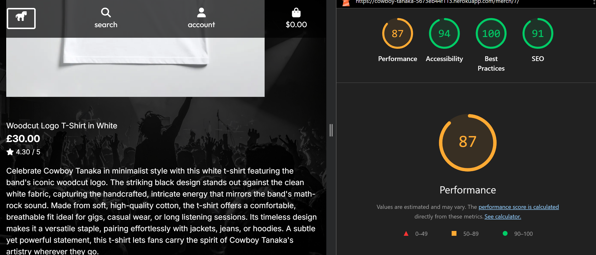

#### __Sign Up Page__

#### __Sign In Page__

#### __Sign Out Page__

### Testing User Stories

| Goals                 | How are they achieved?
| --------------------- | ---------------------- | 
| Info Page | - Page displays a readable Band, member and musical biography. | 
| | - Band member names, roles, and images are visible. | 
| News Page | -Posts display with title, date, author, and body text. |
|| - Posts are sorted by most recent. |
| Tour Dates Page | - Each tour entry shows date, venue, location. |
|| - Upcoming events appear in chronological order. |
| Ticket Links | - Instead of previously planned, tickets can now be purchased on site. |
| Merchandise Page | - Products display with image, title, price. |
|| - Products can be browsed by category. |
|| - Products when chosen are added to the bag. |
| Integrated Payment Method | - Users can seamlessly use the site integrated Stripe payment method. |
| User Accounts | - Users can sign up with email and password. |
|| - Users can log in/out securely. |
|| - Profile displays user details and order history. |
| Search Function | - Clicking result directs user to the filtered merch page. |
| Shopping Bag | - Users can add more than one product.|
|| - Bag icon updates with item count.|
|| - Bag contents remain until cleared or checked out.|
| Cost Calculations | - Bag shows subtotal, postage, tax, and grand total.|
|| - Calculations update correctly when items are added/removed. |

### Functional Testing

#### Navbar

| Feature | Expected Outcome | Testing Performed | Result | Pass/Fail |
|---------|------------------|-------------------|--------|-----------|
| Home Page Nav Link (Page Logo) | Home Page Loads | Clicked on Link | Taken to Page | Pass |
| Info Page Nav Link | Info Page Loads | Clicked on Link | Taken to Page | Pass |
| News Page Nav Link | News Page Loads | Clicked on Link | Taken to Page | Pass |
| Tour Dates Page Nav Link | Tour Dates Page Loads | Clicked on Link | Taken to Page | Pass |
| Merch Page Nav Link | Merch Page Loads | Clicked on Link | Taken to Page | Pass |
| Search Bar Link | Merch Page Loads with Filtering | Clicked on Link | Taken to Page with Filtering | Pass |
| Sign Up Page Nav Link | Sign Up Page Loads | Clicked on Link | Taken to Page | Pass |
| Sign In Page Nav Link | Sign In Page Loads | Clicked on Link | Taken to Page | Pass |
| Sign Out Page Nav Link | Sign Out Page Loads | Clicked on Link | Taken to Page | Pass |
| Merch Management Page Nav Link | Merch Management Page Loads | Clicked on Link | Taken to Page | Pass |
| Tour Dates Management Page Nav Link | Tour Dates Management Page Loads | Clicked on Link | Taken to Page | Pass |
| My Profile Page Nav Link | My Profile Page Loads | Clicked on Link | Taken to Page | Pass |
| Shopping Bag Page Nav Link | Shopping Bag Page Loads | Clicked on Link | Taken to Page | Pass |

#### Home

| Feature | Expected Outcome | Testing Performed | Result | Pass/Fail |
|---------|------------------|-------------------|--------|-----------|
| Shop Now Button | Merch Page Loads | Clicked on Button | Taken to Page | Pass |

#### Sign Up

| Feature | Expected Outcome | Testing Performed | Result | Pass/Fail |
|---------|------------------|-------------------|--------|-----------|
| Sign In Page Link | Sign In Page Loads | Clicked on Link | Taken to Page | Pass |
| Bag to Sign In Button | Sign In Page Loads | Clicked on Button | Sign In Page Loads | Pass |
| Sign Up Button | User Signed Up | Clicked on Button | User Signed Up (providing details fit criteria), Email is Sent | Pass |

#### Sign In

| Feature | Expected Outcome | Testing Performed | Result | Pass/Fail |
|---------|------------------|-------------------|--------|-----------|
| Sign Up Page Link | Sign Up Page Loads | Clicked on Link | Taken to Page | Pass |
| Home Button | Home Page Loads | Clicked on Button | Taken to Page | Pass |
| Sign In Button | User Signed In | Clicked on Button | User Signed In | Pass |

#### Sign Out

| Feature | Expected Outcome | Testing Performed | Result | Pass/Fail |
|---------|------------------|-------------------|--------|-----------|
| Sign Out Button | User Signed Out | Clicked on Button | User Signed Out | Pass |
| Cancel Button | Merch Page Loads | Clicked on Button | Sign Out Cancelled | Pass |

#### Info

| Feature | Expected Outcome | Testing Performed | Result | Pass/Fail |
|---------|------------------|-------------------|--------|-----------|
| No Links |||||

#### News

| Feature | Expected Outcome | Testing Performed | Result | Pass/Fail |
|---------|------------------|-------------------|--------|-----------|
| Read More Link | News Detail Page Loads | Clicked on Link | Taken to Page | Pass |

#### News Detail

| Feature | Expected Outcome | Testing Performed | Result | Pass/Fail |
|---------|------------------|-------------------|--------|-----------|
| No Links |||||

#### Tour Dates

| Feature | Expected Outcome | Testing Performed | Result | Pass/Fail |
|---------|------------------|-------------------|--------|-----------|
| Buy Tickets Button | Tour Dates Detail Page Loads | Clicked on Link | Taken to Page | Pass |

#### Tour Dates Detail

| Feature | Expected Outcome | Testing Performed | Result | Pass/Fail |
|---------|------------------|-------------------|--------|-----------|
| Minus Button | Lowers ticket quantity by 1 (not below zero) | Clicked on Button | Quantity Lowered (not below zero) | Pass |
| Ticket Quantity Box | Able to enter number above zero | Entered number above zero | Number Entered | Pass |
||| Entered number below zero | Pop up stated number must greater than or equal to one | Pass |
| Plus Button | Raises ticket quantity by 1 | Clicked on Button | Quantity Raised | Pass |
| Keep Shopping Button | Tour Dates Page Loads | Clicked on Button | Taken to Page | Pass |
| Add to Bag Button | Tickets Added to Bag | Clicked on Button | Tickets Added to Bag | Pass |

#### Merch

| Feature | Expected Outcome | Testing Performed | Result | Pass/Fail |
|---------|------------------|-------------------|--------|-----------|
| Media Button | Filters Merch to only show Media items | Clicked on Link | Filters Merch to only show Media items | Pass |
| Clothing Button | Filters Merch to only show Clothing items | Clicked on Link | Filters Merch to only show Clothing items | Pass |
| Accessories Button | Filters Merch to only show Accessories items | Clicked on Link | Filters Merch to only show Accessories items | Pass |
Merch Thumbnail | Merch Detail Page Loads | Clicked on Thumbnail | Taken to Page | Pass |

#### Merch Detail

| Feature | Expected Outcome | Testing Performed | Result | Pass/Fail |
|---------|------------------|-------------------|--------|-----------|
| Minus Button | Lowers item quantity by 1 (not below zero) | Clicked on Button | Quantity Lowered (not below zero) | Pass |
| Item Quantity Box | Able to enter number above zero | Entered number above zero | Number Entered | Pass |
||| Entered number below zero | Pop up stated number must greater than or equal to one | Pass |
| Plus Button | Raises item quantity by 1 | Clicked on Button | Quantity Raised | Pass |
| Keep Shopping Button | Merch Page Loads | Clicked on Button | Taken to Page | Pass |
| Add to Bag Button | Item Added to Bag | Clicked on Button | Item Added to Bag | Pass |

#### Bag

| Feature | Expected Outcome | Testing Performed | Result | Pass/Fail |
|---------|------------------|-------------------|--------|-----------|
| Minus Button | Lowers item quantity by 1 (not below zero) | Clicked on Button | Quantity Lowered (not below zero) | Pass |
| Item Quantity Box | Able to enter number above zero | Entered number above zero | Number Entered | Pass |
||| Entered number below zero | Pop up stated number must greater than or equal to one | Pass |
| Plus Button | Raises item quantity by 1 | Clicked on Button | Quantity Raised | Pass |
| Update Button | Updates Quantity in Bag | Clicked on Button | Updates Quantity in Bag | Pass |
| Remove Button | Removes Item from Bag | Clicked on Button | Removes Item from Bag | Pass |
| Keep Shopping Button | Merch Page Loads | Clicked on Button | Taken to Page | Pass |
| Checkout Button | Checkout Page Loads | Clicked on Button | Taken to Page | Pass |

#### Checkout

| Feature | Expected Outcome | Testing Performed | Result | Pass/Fail |
|---------|------------------|-------------------|--------|-----------|
| Sign Up Page Nav Link | Sign Up Page Loads | Clicked on Link | Taken to Page | Pass |
| Sign In Page Nav Link | Sign In Page Loads | Clicked on Link | Taken to Page | Pass |
| Adjust Bag Button | Bag Page Loads | Clicked on Button | Taken to Page | Pass |
| Complete Order Button | Checkout Success Loads & Confirmation Email Sent | Clicked on Button | Taken to Page & Email Sent | Pass |

### Validator Testing 

#### HTML
  - No errors were returned when passing through the official [W3C Validator](https://validator.w3.org)

  Home HTML

  

  Info HTML

  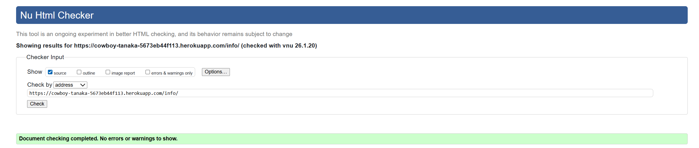

  News HTML

  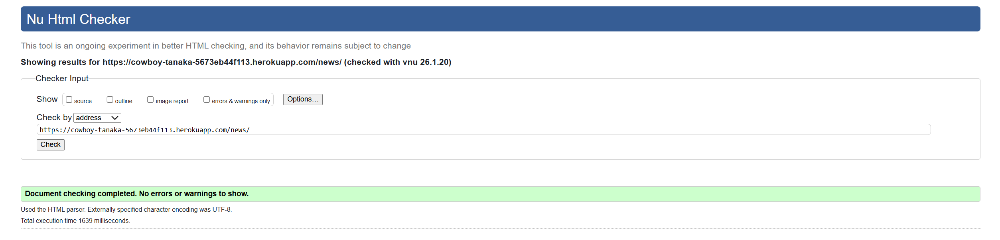

  News Detail HTML

  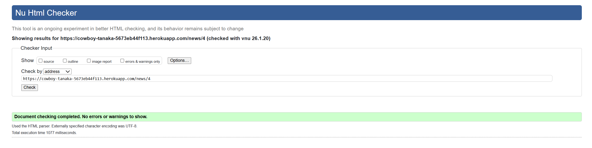

  Tour Dates HTML

  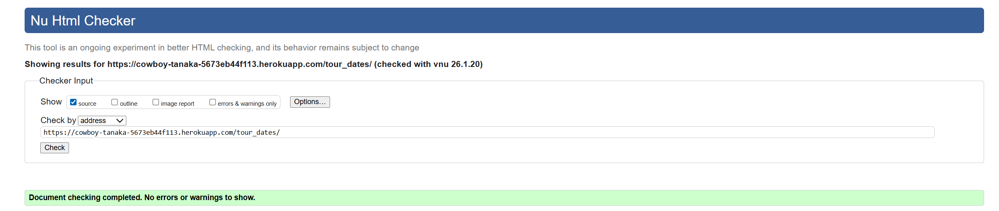

  Tour Dates Detail HTML

  

  Merch HTML

  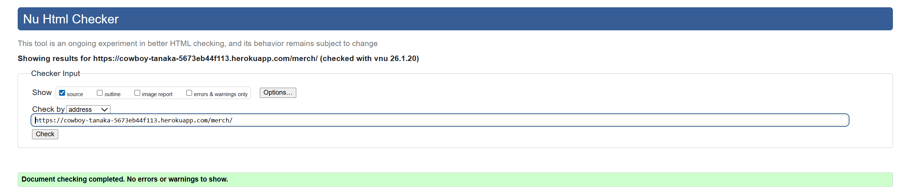

  Merch Detail HTML

  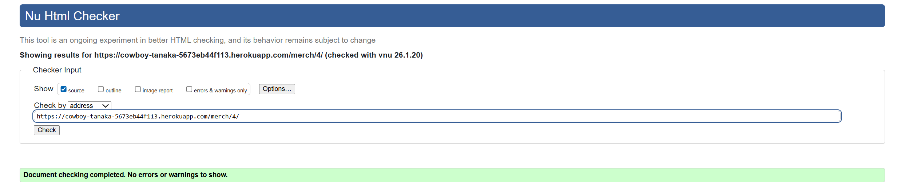

  Bag HTML

  

#### CSS
  - No errors were found when passing through the official [Jigsaw Validator](https://jigsaw.w3.org)

  Base CSS

  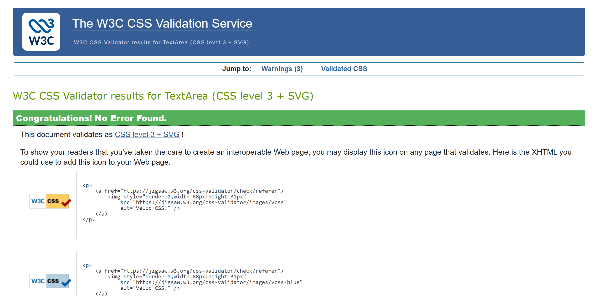

  Profile CSS
  
  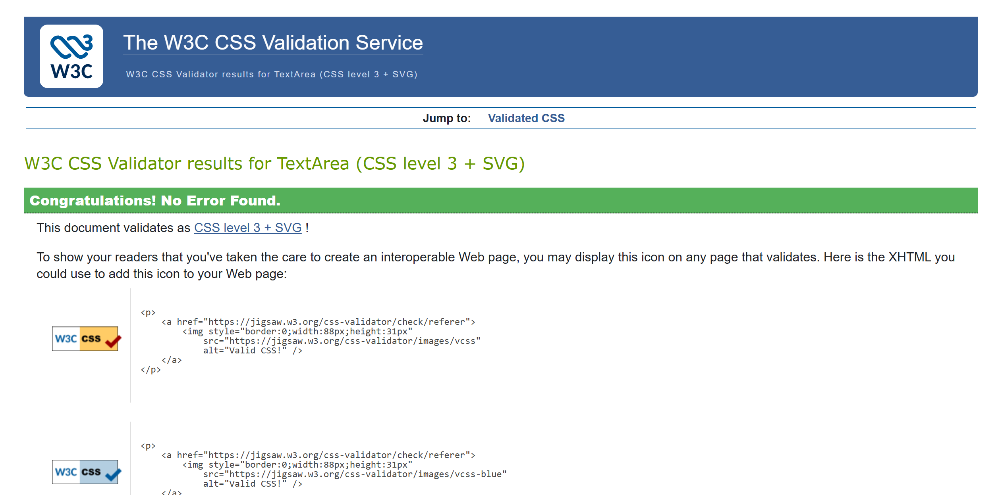

  Checkout CSS

  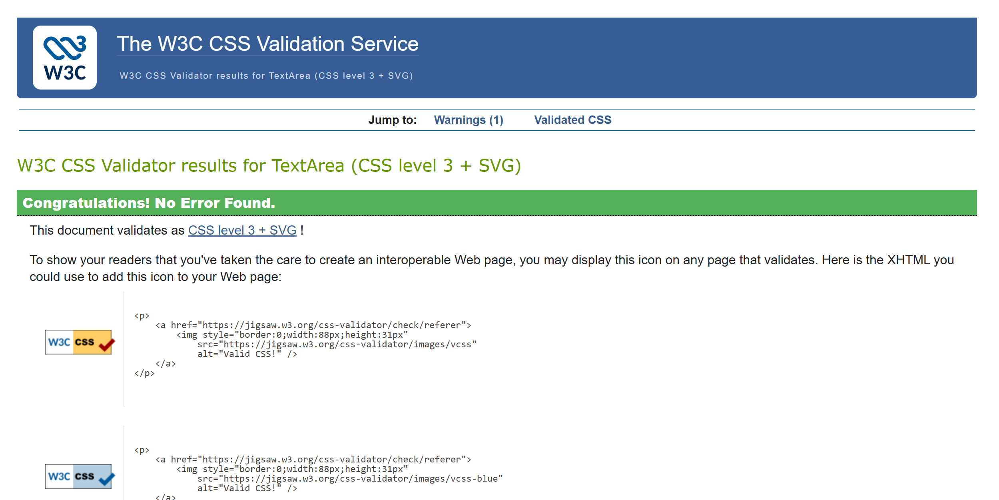

#### JavaScript
 - No errors were found when passing through the official [JSHint Validator](https://www.jshint.com/)

  Country Field JS  

  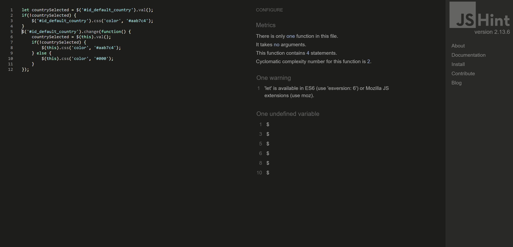

  Stripe Elements JS

  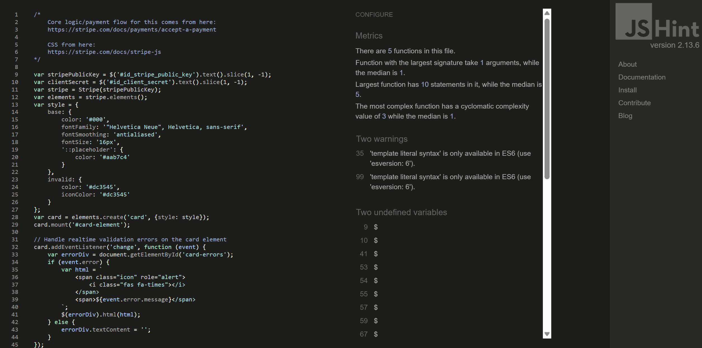

#### Python
- No errors were found when passing through the Code Institute Python Linter [Python Validator](https://pep8ci.herokuapp.com/)

Example

  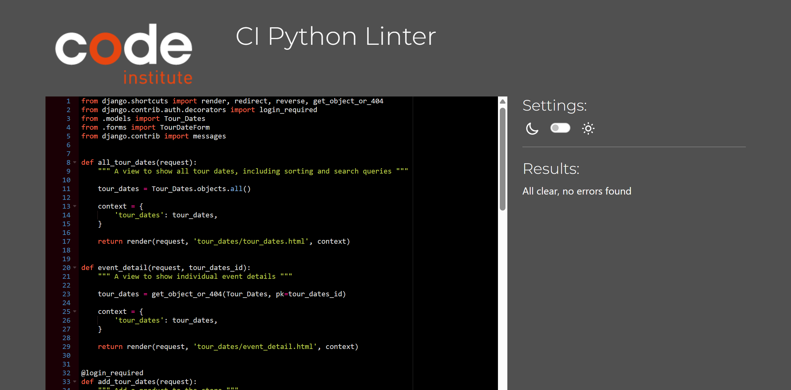

### Fixed Bugs

| Bug | Solution |
|------|-----------|
| Issue with targetting allauth buttons | Fixed with more precise targetting | 
| Favicon not displaying sitewide | Fixed incorrect href syntax |
| Product size diplay issue in bag | Found and corrected incorrectly titled parameter names in both views and bag.html. |
| Django secret key not hidden | Moved to env.py and linked in settings.py |
| Admin edit function not working on merch | Found and corrected incorrectly titled parameter names in both views and urls. |
| Images not displaying on deployed site | Incorrect file types assigned between AWS hosting and database. |
| Registration email not sending | Email not set up properply. |
| Confirmation email not sending | WH secret incorrect and titled incorrectly. |

### Unfixed Bugs

* No known bugs.